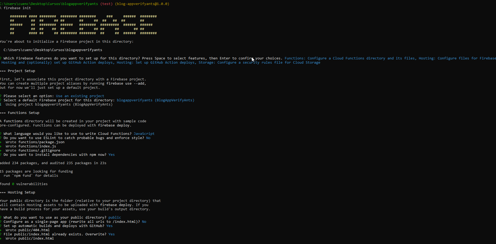

# blogappverifyants
```Curso de Firebase,  Para este caso usare este conocimiento para crearun blog de enseñar a la personas como administrar sus recursos.```

# 05 - Curso de Firebase 5 para Web

## Clase 1: Bienvenida 
- Profesor Juan Guillermo Gómez Torres

## Clase 2 : ¿Qué es Firebase?

**Firebase** 
> Es un Backend como Servicio, es decir, esta herramienta nos permite conectarnos desde cualquier aplicación a las tareas de backend y despliegue de nuestras aplicaciones de forma mucho más simple, mantenible y escalable.

> Tareas como crear y autenticar usuarios, guardar nuestra información en bases de datos, almacenar archivos estáticos, administrar la infraestructura, analizar métricas, entre muchas otras. Gracias a Firebase automatizamos y agilizamos todos estos servicios en una misma plataforma integrada sobre la infraestructura de Google Cloud.

**Servicios de Firebase para la Web:**

- Cloud Firestore: Almacenamiento y sincronización de los datos de nuestra aplicación a escala global, funciona como una base de datos NoSQL.
- Autenticación: Autenticación de usuarios de manera simple, rápida y segura con email y contraseña, redes sociales o mensajes de texto.
- Cloud Storage: Almacenar y atender nuestros archivos (imágenes, vídeos, etc) a la escala de Google.
- Cloud Messaging: Envío de mensajes y notificaciones segmentadas.
- Hosting: El sistema de Google Cloud para almacenar la información de nuestra página web.
- Cloud Functions: Administración del código de backend necesario para desplegar nuestras aplicaciones a los servidores de Google Cloud.
- Integraciones: Podemos conectar las funciones de Firebase a otros servicios de Google (Google Ads, Google Marketing Platform, entre otras) o incluso a servicios de terceros como Slack, Data Studio y BigQuery.


https://platzi.com/tutoriales/1435-firebase-web/8710-instala-y-corre-el-proyecto-del-curso-en-tu-computadora-sin-problemas/

## Clase 3: El proyecto que crearás PILOTO 

**Iniciando Proyecto**

- Paso 1: Entramos al enlace pero previamente debemos logearnos como ya yo tengo una cuenta google ya se me facilita un poco, pero aqui debes de tener una cuenta activa de gooogle. 

**Inicio**


- Paso 2: Clic en Crear 
  - Debes crear un proyecto con el nombreUnico de tu proyecto, al mismo tiempo nos da un identificador unico del proyecto. a parte de colocar el nombre debeos hablar con nuestro cliente o no si deseamos usar el google Analytic para medir datos entre otras funciones que te da google, para este caso pues es uso propio le vamos a decir que si para ver como se mueve nuestro proyecto en el mundo. 

**Inicio**


    - Elegimos en que cuenta de google queremos el proyecto 

    - Esperamos hasta que el proyecto se genere 

    - Aqui terminamos el paso 2, se genera el proyecto y nos muestra el panel 

    - Aqui determinamos el plan en este caso es el gratuito llamado spark 


## Clase 4: Consola de administración  Explicación 

> Configuración del proyecto. 
**Como podemos ver los datos del proyecto**
- Aqui vemos los datos del proyecto 


- aqui podemos generar un Apu publica para que puedan usar 


- aqui podemos ingresar los usuarios para que puedan colaborar en el proyecto 


**Nota**
- La ubicación de los servidores NO se puede cambiar después de crear el proyecto
- Aunque normalmente Firebase se usa en el frontend también puede usarse en el backend.
- Existen SDK para Nodejs, Java, Python y Go. (existen librerías de terceros para otros lenguajes creadas por las diferentes comunidades)
- En la versión de Firebase actual (Junio 17 de 2021) el campo de la “Clave de API de la web” es creado sin valor alguno.


## Clase 5: Configuración de Firebase en el proyecto

- Paso 1: Seguimos los pasos que nos indica el generador de proyecto. 
  - Damos clic sobre el icono, es importante resaltar que esta guia cambia durante el tiempo  
  - 

- Paso 2: Seguimos como un wizard los pasos para poder conectar nuestro código con firebase 
  - 

- Paso 3: Como lo indica la imagen instalamos `npm install firebase` y creamos en nuestro directorio js `config/ConfigFirebase.js` aqui pegamos el código que nos indica el wizard de google luego vamos a nuestro archivo index.hmtml y lo anexamos para lograr la conexicón con firebase
  - 

- Paso 4: Seguimos con el wizard en este caso debemos instalar el Instala Firebase CLI `npm install -g firebase-tools`  

  - 
- Paso 5: Ya como  ultimo paso, podemos iniciar nuestro proyecto web en firebase pero previamente debemos tener nuestro proyecto en nuestro github de manera unica y limpia ya que usa Github como base para poder copiar ese repo en firebase y los cambios que subas en github de manera automatica los toma firebase. **Nota** debes correr estos comando en consola de `windows o de github`  
 - 
 - 
  

**Nota**
- Esta primera instalación se pasaron de mamones
  - Primero necesitas pasar tu cuenta a `Blaze`
  - Segundo si usas el comando de `firebase init` y `firebase deploy` a fuerza necesitas configurar la EL COMPONENTE `funtions` para esto pues debes leer bien la guia y usar bien el tutorial ya que el firebase init te permite paso a paso realizar un dummy pero hay detalles primero DEBES CREAR EL DIRECTORIO `funtions/index.ts` extension se usa `TS`
 
 > Todo esto es para levantar un proyecto pero con esto si creaste ya tu proyecto en Github al menos el cascaton lo puedes ver ya enlinea con el componenete HOSTING QUE tiene Google Firebase 

 ## Clase 6: Servicios de autenticación y configuración de usuarios

> Firebase nos proporciona una configuración muy sencilla para manejar la creación de usuarios, inicio de sesión y logout de la aplicación con email y password o con redes sociales (Google Accounts, Facebook, Twitter, Github o incluso nuestros proveedores personalizados).

>Firebase nos proporciona SDKs (Software Development Kits) para facilitar la programación y configuración de estas funcionalidades en los lenguajes y plataformas más comunes, en caso de no encontrar estas librerías oficiales podemos encontrar diferentes herramientas creadas por la comunidad. Tambien tenemos acceso y control muy personalizado de toda esta información gracias a la Consola de Firebase.

> Gracias al servicio de autenticación de usuarios de Firebase podemos ahorrar mucho tiempo programando estas mismas funcionalidades por nuestra cuenta.

**Como**
- Primero aqui te dejo la documentación -> https://firebase.google.com/docs/auth/web/password-auth?hl=es&authuser=0
- Paso 1: Debemos entrar a nuestra consola y habilitar el componenete `Autentication`
  - 
  - Escogemos correo y contraseña la cual usaremos 
  - 
  - Luego de validar e iniciar en `Consola` que vamos usar `Autentication` debemos ir al script 
  - Es importante resaltar que hay muchos componentes por lo que se necesita leer mas y probar, pero con esto ya podremos usar FIREBASE para administrar nuestros usuarios. 
- Paso 2: Esto es a nivel de código fuente, hay que ser precisos aquí. para este ejemplo cree un servidor que pueda consumir APIS en este caso los componentes de `Autentication` y creando una pagina estatica donde estará nuestro front. 
- PD-> Leonard Recuerda que express se puede usar para back como front solo que al crear tu archivo `server` debemos configurarlo tal cual como esta aquí para prevenir estas fallas como hoy 09/09/2022 [server.js](C:\Users\cuenc\Desktop\Cursos\blogappverifyants\server\server.js)

  - Paso 2.1: Debemos configurar el `firebaseConfig`, tiene datos sencibles pero esto nos ayuda a establecer nuestra conexion con `firebase`, para este caso lo estoy usando como un metodo dentro de mi servicio web API que se conectará con el front. 
```
    this.firebaseConfig = {
      apiKey: "",
      authDomain: "",
      projectId: "",
      storageBucket: "",
      messagingSenderId: "",
      appId: "",
      measurementId: ""
    };
``` 
  - Paso 2.2: usamos los metodos que nos indica `Firebase` y lo usare para este caso como un metodo que se implementa en el servicio web   
```
  async registro(data) {
    const app = initializeApp(this.firebaseConfig);
    //const analytics = getAnalytics(app);
    const auth = getAuth();

    let respuesta =  createUserWithEmailAndPassword(auth, data.email, data.password)
      .then((userCredential) => {
        // Signed in
        console.log("Entro->",userCredential.user);
        return  userCredential.user;
      })
      .catch((error) => {
        const errorCode = error.code;
        const errorMessage = error.message;
        console.table('Error->',errorCode,errorMessage);
        return errorMessage;
      });

    return respuesta;
  }
```
  - Paso 2.3: claro no se te olvide implementar los pquetes para poder lograr la conexión con `firebase`
```
import { initializeApp } from "firebase/app";
import { getAuth, createUserWithEmailAndPassword, signInWithEmailAndPassword  } from "firebase/auth";
import { getAnalytics } from "firebase/analytics";
```
  - PD: Recuerda configurar bien tu babel ya que sin esto configurado no podras usar los `import` que es algo que me dio mucho trabajo ya que en `nodejs` se usan los `require()`
```
//Instalas  
npm i @babel/cli @babel/core @babel/node @babel/preset-env nodemon

//crea y Configura -> touch .babelrc

{
    "presets": [
      ["@babel/env", {
        "targets": {
          "node": "current"
        }
      }]
    ]
  }

//Configura tu package.json y reinicia todo si tienes el servidor levatando 
  "scripts": {
    "dev": "nodemon index.js",
    "start": "nodemon --exec babel-node index.js",
    "build": "babel-node index.js",
    "lint": "eslint"
  },
```

## Clase 14: Firestore

> Firestore es una base de datos NoSQL en formato JSON, es una herramienta muy flexible y nos permite guardar información sin estructuras o atributos predeterminados, además, es soportado por los servicios de Google Cloud, nuestra aplicación puede multiplicarse en diferentes regiones para aumentar su performance y no tendremos problemas de escalamiento.

> Además del formato JSON, tenemos disponibles algunas nuevas estructuras para manejar la información y construir mejor nuestra base de datos. Firestore también es Cross Platform, es decir, tiene soporte y multiples herramientas para construir aplicaciones en diferentes plataformas de Frontend y Backend, entre estos servicios encontramos el soporte offline.


**Resumen:**

- Firestore es una base de datos NoSQL en formato JSON
- El formato JSON con super poderes, tenemos toda la flexibilidad para utilizar o no los atributos que necesitemos, podemos utilizar otros tipos de estructuras de datos pero al final siempre resulta en JSON
- Tiene soporte de Google Cloud, es decir, es increíblemente escalable y se multiplica por diferentes regiones para mejorar el performance de nuestras aplicaciones
- Cross Platform: Soporta y construye herramientas de desarrollo para todas las plataformas (mobile, web y backend) 🎬
- Tenemos soporte offline 🎉 ⛱
- Operaciones por lotes, es decir, multiples updates, deletes y todo este tipo de operaciones al mismo tiempo 😮


## Clase 16: Firebase Consultar

**Como**
- Paso 1: Debemos leer la documentación recuerda esta vaina se actualiza cada sierto tiempo [Documentación](https://firebase.google.com/docs/web/setup?authuser=0&hl=es)

- Paso 2: Aqui usaremos el paquete para conectarnos a la base de datos debemos ejecutar el instalador: 
  - Comando `npm install firebase` 

- Paso 3: Debemos conectarnos la mejor manera es creando un config: en algun API para este ejemplo hare  lo siguiente: 

  - Paso 3.1: Debemos acceder al config recuerda es la llave para hacer todo 
```
import { initializeApp } from "firebase/app";

const app = initializeApp(this.firebaseConfig);

```
  - Paso 3.2: Debemos importar lo que necesitamos para este ejemplo lo importamos en nuestro servicio 
```
import { getFirestore, collection, getDocs } from 'firebase/firestore/lite';
```

  - Paso 3.3: podemos agregar este fragento de código de esta manera y enseguida ya lo explico. 
```
  //Servicio-Firebase: Me Permite conectar y conultar un Documento dentro de la base de datos de Firebase
  async getPosts() {
    const app = initializeApp(this.firebaseConfig);
    const db = getFirestore(app);

    const postsCol = collection(db, 'posts');
    const postsSnapshot = await getDocs(postsCol);
    const postsList = postsSnapshot.docs.map(doc => doc.data());
    return postsList;
  }
}
``` 
  Paso 3.4: como ver pasa lo siguiente para este ejemplo estoy usando una clase para traer dicha información ya que usare un API,  es una promesa por lo que prevenimos con un async luego usamos una constante `app` que nos ayuda con la inicialización con nuestra `LLAVE` usando esta variable usaremos el metodo importado `getFirestore(app)` incluimos nuestra llave, pero al mismo tiempo usamos una constante `db` donde aqui podremos conectarnos a nuestros `firebase` de nuestro proyecto luego  usamos el método `colecction` previamente importado con el nombre de tu coleccion que creaste previamente en firebase ojo este caso debe ser el primer paso: 
    
  Por ultimo pues creamos nuestro bucle para extaer los datos y lugo presentarlos donde estemos llamando nuestro API 

- Paso 4: Validamos la lógica implementada y en efecto nos muestra información 


## Clase 17: Firebase Insertar 

**Como**
- Paso 1: Debemos leer la documentación recuerda esta vaina se actualiza cada sierto tiempo [Documentación](https://firebase.google.com/docs/firestore/manage-data/add-data?hl=es-419)

- Paso 2: Te recomiendo leer la clase 16 antes de insertar 
- Paso 3: Como siempre debemos importar nuestras funciones para poder insertar Nota: se mezclan con las funciones de consultar asi que ojo porque si no te marcará error.
``
import { getFirestore, collection, getDocs, doc, setDoc, Timestamp } from 'firebase/firestore/lite'; 
`` 
- Paso 4: usamos fragmento de código  luego será explicado 
```
//Servicio-Firebase: Me Permite conectar y conultar un Documento dentro de la base de datos de Firebase
  //Deuda Técnica: como es un proyecto pequeño este metodo deberia estar en una clase aparte dedicada a manejar los posts
  async createPost(postData) {

    const data = {
      ... postData,
      dateExample: Timestamp.fromDate(new Date()),
    }

    const app = initializeApp(this.firebaseConfig);
    const db = getFirestore(app);
    const postsRef = doc(collection(db, "posts"));
    const resp =  await setDoc(postsRef, data).then(resp=>{
      return resp;
    }).catch(err=>{
      return err;
    });

    return resp;
  }
```
  -4.1: Como lo comente en la clase 16: para este ejemplo nos estamos apoyando en API, por lo que creamos nuestra función asyn, recibimos como valor lo que nos envia desde el consumo del API, inicializamos con nuestra llave de configuración, creamos una constante `postsRef` para poder indicar el `db` y a que documentos quremos crear mas colecciones, luego usamos el método `setDoc` que recibe como referencia el `postsRef` y la `data` que enviamos desde el cliente y como es una `promesa` pues usamos el `then` y listo, si te envia un error `"code": "invalid-argument", "name": "FirebaseError" ` por favor checa el import ya que me sucedio ese error cuando estaba referenciando mal el import `import { getFirestore, collection, getDocs, doc, setDoc, Timestamp } from 'firebase/firestore/lite';`
